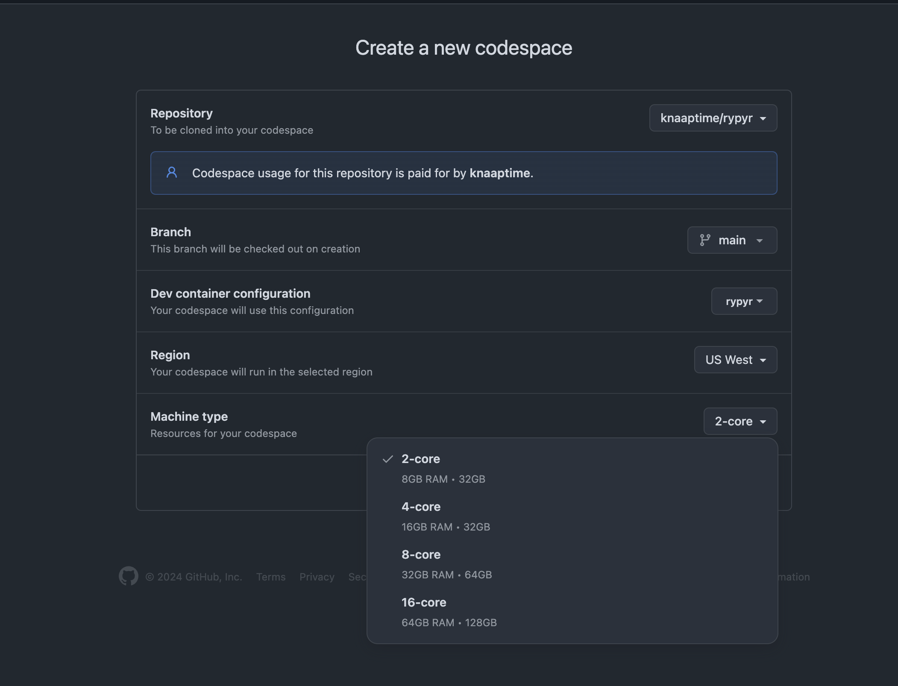

# `rypyr`

pronounced 'ripper', like [repr](), but so that R people can grok reproducible Python environments

tl;dr: I write in quarto and do my work in both python and R. But lots of people still hate Python environments. I swear they are straightforward for this task now!

## Goals

- reproducible python/R environments
  - one-click launch in the cloud
  - consistent cross-platform local environments
- write in quarto markdown 
- include slides

## Install and Run

To run locally:

- clone this repository, follow below

To run in codespaces:

- click the 'open in codespaces' button above
- crank the machine to 4gb (not strictly necessary but you'll want more than 2gb)

`pixi install`

`cd notebooks` (not strictly necessary, but its better to launch jlab from inside the notebooks dir)
`pixi run jupyter lab`

if running in a codespace this starts a jupyter server on the VM's 'localhost'.
Open an existing notebook (or start a new one). When selecting a kernel, choose
'Existing jupyter server' and copy/paste the URL with token from the terminal

edit the notebooks as you like

## Execute and Build

`cd paper`
`pixi run quarto render`

will run the python and r noteooks and generate the html and pdf in `paper/_manuscript`

you can use `pixi run quarto preview` to preview while you work

